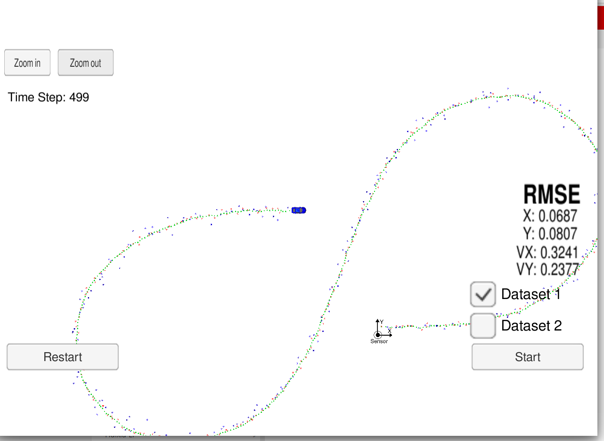
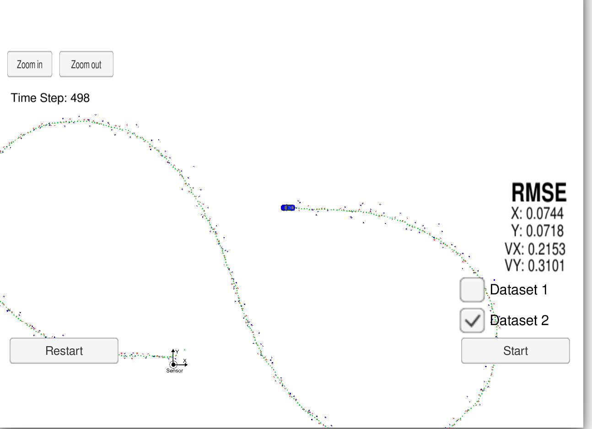

# Unscented Kalman Filter
Udacity Self-Driving Car Nanodegree - Extended Kalman Filter Implementation

## Overview

In this project we utilized a kalman filter to estimate the state of a moving object of interest with noisy lidar and radar measurements. Passing the project requires obtaining RMSE values that are lower than the tolerance outlined in the project rubric. 

This project involves the Term 2 Simulator which can be downloaded [here](https://github.com/udacity/self-driving-car-sim/releases)

This repository includes two files that can be used to set up and install [uWebSocketIO](https://github.com/uWebSockets/uWebSockets) for either Linux or Mac systems. For windows you can use either Docker, VMware, or even [Windows 10 Bash on Ubuntu](https://www.howtogeek.com/249966/how-to-install-and-use-the-linux-bash-shell-on-windows-10/) to install uWebSocketIO. Please see [this concept in the classroom](https://classroom.udacity.com/nanodegrees/nd013/parts/40f38239-66b6-46ec-ae68-03afd8a601c8/modules/0949fca6-b379-42af-a919-ee50aa304e6a/lessons/f758c44c-5e40-4e01-93b5-1a82aa4e044f/concepts/16cf4a78-4fc7-49e1-8621-3450ca938b77) for the required version and installation scripts.

I used ubuntu 16.04 version, for that I used install-linux.sh .

Once the install for uWebSocketIO is complete, the main program can be built and run by doing the following from the project top directory.

1. mkdir build
2. cd build
3. cmake ..
4. make
5. ./UnscentedKF

Tips for setting up your environment can be found [here](https://classroom.udacity.com/nanodegrees/nd013/parts/40f38239-66b6-46ec-ae68-03afd8a601c8/modules/0949fca6-b379-42af-a919-ee50aa304e6a/lessons/f758c44c-5e40-4e01-93b5-1a82aa4e044f/concepts/23d376c7-0195-4276-bdf0-e02f1f3c665d)

Note that the programs that need to be written to accomplish the project are src/FusionEKF.cpp, src/FusionEKF.h, kalman_filter.cpp, kalman_filter.h, tools.cpp, and tools.h in C++.

Here is the main protcol that main.cpp uses for uWebSocketIO in communicating with the simulator.

INPUT: values provided by the simulator to the c++ program

["sensor_measurement"] => the measurement that the simulator observed (either lidar or radar)

OUTPUT: values provided by the c++ program to the simulator

["estimate_x"] <= kalman filter estimated position x
["estimate_y"] <= kalman filter estimated position y
["rmse_x"] <= kalman filter position RMSE x
["rmse_y"] <= kalman filter position RMSE y
["rmse_vx"] <= kalman filter velocity RMSE x
["rmse_vy"] <= kalman filter velocity RMSE y

---

## Prerequisites

* cmake >= 3.5
  * All OSes: [click here for installation instructions](https://cmake.org/install/)
* make >= 4.1 (Linux, Mac), 3.81 (Windows)
  * Linux: make is installed by default on most Linux distros
  * Mac: [install Xcode command line tools to get make](https://developer.apple.com/xcode/features/)
  * Windows: [Click here for installation instructions](http://gnuwin32.sourceforge.net/packages/make.htm)
* gcc/g++ >= 5.4
  * Linux: gcc / g++ is installed by default on most Linux distros
  * Mac: same deal as make - [install Xcode command line tools](https://developer.apple.com/xcode/features/)
  * Windows: recommend using [MinGW](http://www.mingw.org/)

## Compiling and executing the project

1. Clone this repo.
2. Make a build directory: `mkdir build && cd build`
3. Compile: `cmake .. && make` 
   * On windows, you may need to run: `cmake .. -G "Unix Makefiles" && make`
4. Run it: `./UnscentedKF `

## Running the Filter

From the build directory, execute ./ExtendedKF. The output should be:

Listening to port 4567
Connected!!!

As you can see, the simulator connect to it right away.

The simulator provides two datasets. The difference between them are:

- The direction the car (the object) is moving.
- The order the first measurement is sent to the UKF. On dataset 1, the LIDAR measurement is sent first. On the dataset 2, the RADAR measurement is sent first.

Here is the simulator final state after running the UKL with dataset 1:

Here is the simulator final state after running the UKL with dataset 2:

## Project Instructions and Rubric

# [Rubric](https://review.udacity.com/#!/rubrics/748/view) points

## Compiling

### Your code should compile

The code compiles without errors. I used cmake and make commands.

## Accuracy

### px, py, vx, vy output coordinates must have an RMSE <= [.09, .10, .40, .30] when using the file: "obj_pose-laser-radar-synthetic-input.txt which is the same data file the simulator uses for Dataset 1"

The UKF accuracy was:

- Dataset 1 : RMSE <= [0.0687, 0.0807, 0.3241, 0.2377]
- Dataset 2 : RMSE <= [0.0744, 0.0718, 0.2153, 0.3101]

## Following the Correct Algorithm

### Your Sensor Fusion algorithm follows the general processing flow as taught in the preceding lessons.

The Kalman filter implementation can be found [src/ukf.cpp](./src/ukf.cpp) and it is used to predict at [src/ukf.cpp](./src/ukf.cpp#L169) line 221 to 338 and to update line for lidar 344 to 458 and 
for Radar 467 to 579.

### Your Kalman Filter algorithm handles the first measurements appropriately.

The first measurement is handled at [src/ukf.cpp](./src/ukf.cpp#L162) from line 132 to line 188.

### Your Kalman Filter algorithm first predicts then updates.

The predict operation could be found at [src/ukf.cpp](./src/ukf.cpp#L169) line 194 and the update operation from line 198 to 205 of the same file.

### Your Kalman Filter can handle radar and lidar measurements.

Different type of measurements are handled in two places in [src/ukf.cpp](./src/ukf.cpp):

- For the first measurement from line 132 to line 188.
- For the update part from line 198 to 205.

## Code Efficiency

### Your algorithm should avoid unnecessary calculations.

An example of this calculation optimization is when we calculated measurement prediction. We have not calculate sigma point from the begining rather we used the existing ones. 
